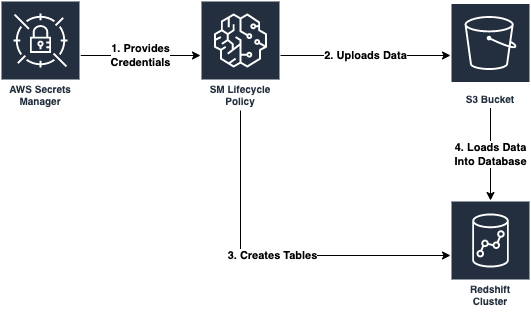
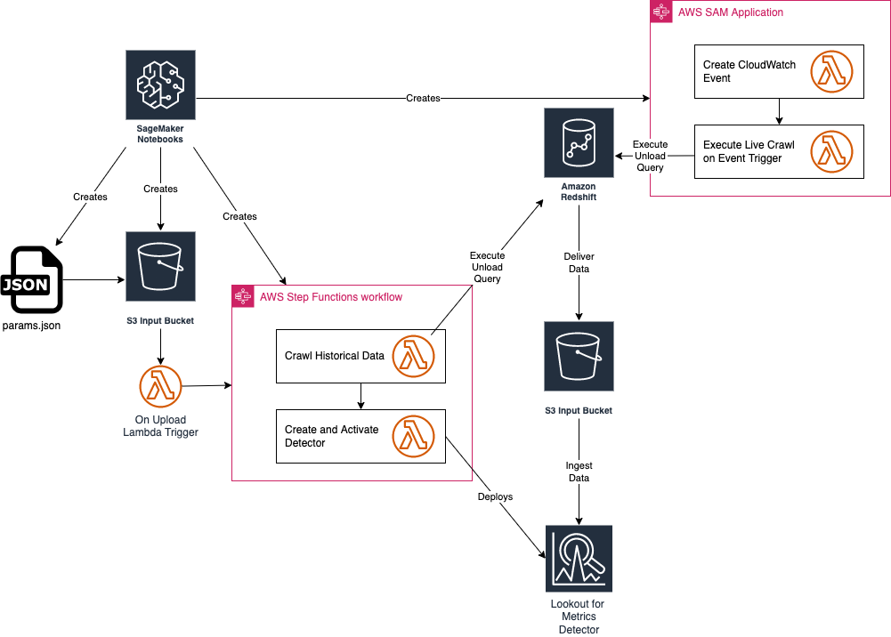

# Amazon Lookout for Metrics Custom Connectors

## Table of Contents

  * [Reasons To Use Built-In Connectors](#reasons-to-use-built-in-connectors)
  * [Reasons to Use Custom Connectors](#reasons-to-use-custom-connectors)
  * [Objectives](#objectives)
  * [Overview](#overview)
    + [Production Like Redshift](#production-like-redshift)
    + [Building and Deploying A Custom Connector](#building-and-deploying-a-custom-connector)
  * [Tutorial](#tutorial)
    + [Deploying and Loading Redshift](#deploying-and-loading-redshift)
    + [Building and Deploying the Custom Connector](#building-and-deploying-the-custom-connector)
  * [How Does This Work / How Can It Be Modified?](#how-does-this-work--how-can-it-be-modified)
    + [How It Works:](#how-it-works-)
    + [How Can It Be Modified?](#how-can-it-be-modified)
      - [Seriously HOW Can This Be Modified?](#seriously-how-can-this-be-modified)
      - [Authentication to Redshift](#authentication-to-redshift)
      - [Optimizations for Redshift](#optimizations-for-redshift)
      - [Modifying Queries to Redshift](#modifying-queries-to-redshift)
      - [Modifying Lookout for Metrics Detector and Dataset](#modifying-lookout-for-metrics-detector-and-dataset)
      - [Modifying for Other Database Systems](#modifying-for-other-database-systems)
  * [Cleanup](#cleanup)

## Reasons To Use Built-In Connectors

Amazon Lookout for Metrics(L4M) has built-in connectors for many database systems like Redshift, RDS, and Aurora. You can get started with these via the APIs for L4M or 
by configuring them inside the console.

Use Built-In Connectors if:
1. Your data exists in a singular table that only contains used by your Anomaly Detector.
2. You are OK with not using your historical data and then waiting for the [Coldstart Period](https://docs.aws.amazon.com/lookoutmetrics/latest/dev/quotas.html#gettingstarted-quotas-coldstart) to elapse before beginning anomaly detection.

## Reasons to Use Custom Connectors

Custom Connectors can be a great solution if:
1. Your data is spread over multiple tables.
2. You need to perform more complex transformation like calculating a derivative value before it fits to a Detector's configuration.
3. You want to leverage all of your historical data to train your Detector. 

## Objectives
This repository serves as a guide and reference for reaching out to complex databases, performing desired ETL processes
on data, then streaming it easily into S3 for use with L4M.

You will see a folder in [sample_resources](sample_resources) for Redshift, this builds a production like environment for demonstration purposes. You can deploy the template linked below
to build this demo environment in your own account, or you can modify the resources in `ai_ops` discussed below to fit the automation to your existing Redshift environment.
Additionally, you can modify the automation there to fit another data source. It serves as an example and framework for performing both a crawl on historical data and how to reliably get
continuous data for anomaly detection with L4M.

## Overview

### Production Like Redshift
The first stage is a CloudFormation template deploying the following:

1. A Redshift cluster inside a VPC
2. Secrets manager for authentication
3. A SageMaker Notebook Instance that executes all the setup processes for the Redshift database and initial dataset loading.
4. An S3 bucket that is used to load data into Redshift.

Together they work like this:



Once this is completed you have a working environment of Redshift that has data stored in multiple tables, the next stage will showcase
how to query that data efficiently and how to store it in S3 for use with L4M, and finally setting up the detector to perform anomaly detection.

### Building and Deploying A Custom Connector
Once a production like environment exists, the and final stage is to simply deploy a custom connector that performs some desired ETL on the data
and connects it with L4M. Here we have a template that deploys the following:



1. A SageMaker Notebook Instance that deploys the rest custom-connector solution.
2. StepFunctions: The first performs a historical crawl of your data, the second configures your detector.
3. An S3 bucket to house all of your Lambda functions as deployed(omitted from architecture diagram).
4. An S3 bucket to house all of your historical and continuous data.
5. A CloudFormation Template and Lambda function that kicks off crawling for your data on a schedule in the future.

With this template deployed everything will be configured for you and your anomaly detection workload will be operational. 
 This template could also be extended to configure an alerting function or to stream data to another source for review later as well.
See our [Re:Invent 2021 Workshop](https://github.com/aws-samples/amazon-lookout-for-metrics-samples/tree/main/workshops/RI2021) for a reference on doing that.

## Tutorial
This tutorial is purposefully quite short, the goal here is to provision a working environment for you as quickly as possible. 

After completing the tutorial you can continue reading below for guidance on extending this solution to your environment.

### Deploying and Loading Redshift
Start by clicking the first `Launch Stack` button below. All default options are fine, it will take a few minutes to complete. When the stack shows `CREATE_COMPLETE`
your account will now contain a production like Redshift environment and you are ready to move onto the next phase.

[](https://console.aws.amazon.com/cloudformation/home#/stacks/new?stackName=ProductionRedshiftDemo&templateURL=https://lookoutformetricsbucket.s3.amazonaws.com/l4m-redshift-sagemakernotebook.yaml)

### Building and Deploying the Custom Connector
1. From the output tab of the above template, obtain the values for `RedshiftCluster` and `RedshiftSecret`, simply copying them to a text file is fine.
2. Deploy the next template by clicking the next `Launch Stack` button, on the second page of this wizard update the value provided for `RedshiftCluster` and `RedshiftSecret` with the one you copied above, everything else default is fine.
[](https://console.aws.amazon.com/cloudformation/home#/stacks/new?stackName=CustomRedshiftConnector&templateURL=https://lookoutformetricsbucket.s3.amazonaws.com/l4m-redshift-solution.yaml)
3. Wait a while, this entire setup can take from 20-40 minutes to complete until your Detector is visible. You'll know that the CloudFormation part is complete when `custom-rs-connector-crawl`
exists and has a status of `CREATE_COMPLETE`. From there it should take only 10 minutes or so before the Lookout for Metrics Detector of `l4m-custom-redshift-connector-detector` exits.

## How Does This Work / How Can It Be Modified?
There are a few key components of this solution:

1. [ai_ops/params.json](ai_ops/params.json) - Configuration file for all step functions and the detector.
2. [ai_ops/l4m-redshift-solution.yaml](ai_ops/l4m-redshift-solution.yaml) - CloudFormation template for deploying the solution.
3. [template.yaml](template.yaml) - CloudFormation template for a SAM application that deploys the historical data Lambda function and a function to create and activate the detector.
4. [ai_ops/lambdas/redshift/redshift-historical-crawl](ai_ops/lambdas/redshift/redshift-historical-crawl) - Lambda function for acquiring all historical data.
5. [ai_ops/lambdas/redshift/redshift-continuous-crawl](ai_ops/lambdas/redshift/redshift-continuous-crawl) - Lambda function for acquiring continuous data.
6. [ai_ops/l4m-redshift-continuous-crawl.yaml](ai_ops/l4m-redshift-continuous-crawl.yaml) - CloudFormation template for a SAM application that establishes the execution frequency of the continuous crawl Lambda and deploying it.

This entire process was kicked off directly by deploying the template in `Building and Deploying the Custom Connector` above.

### How It Works
When [ai_ops/l4m-redshift-solution.yaml](ai_ops/l4m-redshift-solution.yaml) is deployed it creates:

* An S3 bucket for storing all Lambda functions.
* A role for a SageMaker Notebook that has access to modify all relevant resources.
* A SageMaker Notebook Lifecycle Config that contains the startup script to clone all automation onto the notebook, manage the params.json file
and to kick off the shell script [ai_ops/deploy_custom_connector.sh]() to deploy the SAM applications  and further update the params file.

[ai_ops/deploy_custom_connector.sh](ai_ops/deploy_custom_connector.sh) starts by deploying [ai_ops/template.yaml](ai_ops/template.yaml) which creates:

* An S3 bucket for storing the params file and all input data for Lookout for Metrics.
* An S3 bucket policy to allow Lookout for Metrics to communicate with S3.
* A Lambda function that is invoked on the bucket when the params file is uploaded, it will kick off a state machine.
* An IAM role to execute the state machine.
* A shared Lambda layer of support functions.
* A role for Lookout for Metrics to access data in S3.
* A Lambda function to crawl all historical data.
* A Lambda function to create and activate an L4M Detector.
* A state machine that manages the flow between creating that historical dataset and then the detector.

Once the first batch of items has completed, [ai_ops/deploy_custom_connector.sh](ai_ops/deploy_custom_connector.sh) then works to update the params file
with new relevant information from the detector and the IAM roles. It also modifies the Redshift cluster to allow the new 
role for L4M to communicate with the cluster. After sleeping for 30 seconds to facilitate IAM propagation the script
copies the params file to the S3 bucket which will invoke the state machine deployed already.

After the uploading of the params file the script will deploy another SAM application defined in [l4m-redshift-continuous-crawl.yaml](l4m-redshift-continuous-crawl.yaml). 
This simple application defines and deploys and Event Trigger to execute the crawling of live data on a schedule(hourly for example), and a Lambda
function that itself will perform the crawl. 

Both the historical crawled data and the continuously crawled data will arrive in the same S3 Bucket where Lookout for Metrics
will use the information first for training, then as inference data where it is checked for anomalies as it arrives. 

Each Lambda function also contains a `query.sql` file which provides the base query which is handed to Redshift. Later the Lambdas
append `UNLOAD` to each query and to deliver the data to S3 via CSV.

### How Can It Be Modified?

#### Seriously HOW Can This Be Modified?
Start by forking this repository into your own account or at the very least cloning a copy for private development, when making substantial changes you will want to make sure
that the references to this particular repository in the files below are updated and are pointing to publicly accessible endpoints for Git. 

Files Referencing This Repository:

1. [README.md](README.md) - This file, in particular the `Launch Stack` buttons assume you are using the live version you see in this repository only.
2. [ai_ops/l4m-redshift-solution.yaml](ai_ops/l4m-redshift-solution.yaml)- In this template a Jupyter Notebook Lifecycle configuration defines the repository to clone(deploys the custom connector).
3. [sample_resources/redshift/l4m-redshift-sagemakernotebook.yaml](sample_resources/redshift/l4m-redshift-sagemakernotebook.yaml]) - In this template a Jupyter Notebook Lifecycle configuration defines the repository to clone(deploys production Redshift example).

#### Authentication to Redshift
When exploring how to extend this into your own environment the first thing to consider is the authentication to your Redshift cluster. This is accomplished using the [Redshift Data API](https://docs.aws.amazon.com/redshift/latest/mgmt/data-api.html)
 and by storing the credentials inside [AWS Secrets Manager](https://aws.amazon.com/secrets-manager/)

Specifically in secrets manager this solution looks for a known secret name: `redshift-l4mintegration` and containing a JSON structure like this:

```JSON
{
  "password": "DB_PASSWORD",
  "username": "DB_USERNAME",
  "dbClusterIdentifier": "REDSHIFT_CLUSTER_ID",
  "db": "DB_NAME",
  "host": "REDSHIFT_HOST",
  "port": 8192
}
```
If you wish to use a different secret name than the one above you will need to update the value in [ai_ops/l4m-redshift-solution.yaml](ai_ops/l4m-redshift-solution.yaml). If you wish to change the other parameters names, you will want to search
for them in the repository and update their references accordingly.


#### Modifying Queries to Redshift
This solution uses the [Redshift Data API](https://docs.aws.amazon.com/redshift/latest/mgmt/data-api.html) to allow for queries that can be executed asynchronously from the client calling for them.
Specifically it allows a Lambda function to start a query with the database and to then let the DB engine sort out everything including the writing of the data in a desired format to S3. By letting the DB engine
handle this we simplify the operations of our Lambdas and do not have to worry about runtime limits. **IF** you wish to do more complex transformations you may wish to build out more 
Step Function based SAM applications to handle that work, perhaps even using Docker containers over Lambda.

For most modifications you can just edit the query files stored in the two Lambda functions provided. These files are:

* [ai_ops/lambdas/redshift/redshift-historical-crawl/query.sql](ai_ops/lambdas/redshift/redshift-historical-crawl/query.sql)
* [ai_ops/lambdas/redshift/redshift-continuous-crawl/query.sql](ai_ops/lambdas/redshift/redshift-continuous-crawl/query.sql)

Note you will want to pay attention to the continuous crawl to ensure that the date ranges coincide with your desired detection interval. For example:

```sql
select ecommerce.ts as timestamp, ecommerce.views, ecommerce.revenue, platform.name as platform, marketplace.name as marketplace
from ecommerce, platform, marketplace
where ecommerce.platform = platform.id
	and ecommerce.marketplace = marketplace.id
    and ecommerce.ts < DATEADD(hour, 0, getdate())
    and ecommerce.ts > DATEADD(hour, -1, getdate())
```

The code snippet above is our demo continuous crawl function and uses the `DATEADD` function to compute data within the last hour. Coupled with the CloudWatch Event trigger that schedules this 
function for hourly it allows us to stream data to Lookout for Metrics reliably. 

The work defined in the `query.sql` files is only a portion of the final computed query however, the full query is built by the respective python files in each folder and appends:

* IAM Role for Redshift to use for the query 
* S3 Bucket Information for where to place the files
* CSV file export defined

It looks like this:

```sql
unload ('select ecommerce.ts as timestamp, ecommerce.views, ecommerce.revenue, platform.name as platform, marketplace.name as marketplace
from ecommerce, platform, marketplace
where ecommerce.platform = platform.id
	and ecommerce.marketplace = marketplace.id
    and ecommerce.ts < DATEADD(hour, 0, getdate())
    and ecommerce.ts > DATEADD(hour, -1, getdate())') 
to 's3://BUCKET/ecommerce/live/20220112/1800/' 
iam_role 'arn:aws:iam::ACCOUNT_ID:role/custom-rs-connector-LookoutForMetricsRole-' header CSV;
```

As long as your prepared query can be encapsulated by the `Unload` statement then it should work with no issues. 


If you need to change the frequency for how often the continuous detector function is executed, update the CRON expression in [ai_ops/l4m-redshift-continuous-crawl.yaml](ai_ops/l4m-redshift-continuous-crawl.yaml).
It is defined in the last line as: `Schedule: cron(0 * * * ? *)`.

### Optimizations for Redshift

This section will definitely expand as more people work with this solution. 

#### Using Redshift's Scheduled Queries
An easy one to implement would be to remove the Lambda function that performs the continuous query, in favor of using Redshift's scheduled query capability. This was not done
inside the default solution to showcase how to provide a more generic capability for other systems. 

To do this you need to:

1. Create your continuous query and event scheduler via JSON and store it in the repository. It should look like this:
```json
{
  "Rule": "scheduled-refresh-mv-cust-trans-hist",
  "EventBusName": "default",
  "Targets": [
    {
      "Id": "scheduled-refresh-mv-cust-trans-hist",
      "Arn": "arn:aws:redshift:us-east-1:{ACCOUNT_ID}:cluster:{REDSHIFT_CLUSTER_IDENTIFIER}",
      "RoleArn": "arn:aws:iam::{ACCOUNT_ID}:role/{ROLE_NAME}",
      "RedshiftDataParameters": {
        "SecretManagerArn": "arn:aws:secretsmanager:us-east-1:{ACCOUNT_ID}:secret:{SECRET_NAME-xxxxxx}",
        "Database": "dev",
        "Sql": "REFRESH MATERIALIZED VIEW mv_cust_trans_hist;",
        "StatementName": "refresh-mv-cust-trans-hist",
        "WithEvent": true
      }
    }
  ]
}
```
2. Update [ai_ops/deploy_custom_connector.sh](ai_ops/deploy_custom_connector.sh) to add your new event via the AWS CLI, for example
```sh
aws events put-targets --cli-input-json file://data.json
```
3. Remove the line deploying `l4m-redshift-continuous-crawl.yaml` inside [ai_ops/deploy_custom_connector.sh](ai_ops/deploy_custom_connector.sh).


#### Modifying Lookout for Metrics Detector and Dataset
The very last components all focus on Lookout for Metrics itself, mainly the Detector and Dataset configurations. They are both defined in [ai_ops/params.json](ai_ops/params.json).

The included file looks like this:

```json
{
  "database_type": "redshift",  
  "detector_name": "l4m-custom-redshift-connector-detector",
    "detector_description": "A quick sample config of how to use L4M.",
    "detector_frequency": "PT1H",
    "timestamp_column": {
        "ColumnFormat": "yyyy-MM-dd HH:mm:ss",
        "ColumnName": "timestamp"
    },
    "dimension_list": [
        "platform",
        "marketplace"
    ],
    "metrics_set": [
        {
            "AggregationFunction": "SUM",
            "MetricName": "views"
        },
        {
            "AggregationFunction": "SUM",
            "MetricName": "revenue"
        }
    ],
    "metric_source": {
        "S3SourceConfig": {
            "FileFormatDescriptor": {
                "CsvFormatDescriptor": {
                    "Charset": "UTF-8",
                    "ContainsHeader": true,
                    "Delimiter": ",",
                    "FileCompression": "NONE",
                    "QuoteSymbol": "\""
                }
            },
            "HistoricalDataPathList": [
                "s3://id-ml-ops2-inputbucket-18vaudty8qtec/ecommerce/backtest/"
            ],
            "RoleArn": "arn:aws:iam::059124553121:role/id-ml-ops2-LookoutForMetricsRole-IZ5PL6M7YKR1",
            "TemplatedPathList": [
                    ""
                ]
        }
    },
    "s3_bucket": "",
    "alert_name": "alerter",
    "alert_threshold": 1,
    "alert_description": "Exports anomalies into s3 for visualization",
    "alert_lambda_arn": "",
    "offset": 300,
    "secret_name": "redshift-l4mintegration"
}
```

Parameters Managed in [ai_ops/params.json](ai_ops/params.json):

* database_type 
* detector_name
* detector_description
* detector_frequency
* timestamp_column and details
* dimension_list
* metrics_set
* offset

Not every value can be defined statically ahead of time however, and these are updated by [ai_ops/params_builder.py](ai_ops/params_builder.py) and they are: 

* HistoricalDataPathList
* RoleArn
* TemplatedPathList
* s3_bucket

If you would like to modify any of these entities, simply update the file responsible for them and your Detector will be modified accordingly. 

### Modifying for Other Database Systems
If you do not use Redshift you will need to:
1. Create a Lambda function that can authenticate via secrets manager to extract and transform your historical data, delivering to s3 as defined in [ai_ops/lambdas/redshift/redshift-continuous-crawl/redshift-historical-crawl.py](ai_ops/lambdas/redshift/redshift-continuous-crawl/redshift-historical-crawl.py)
2. The exact same but for your continuous data as defined in [ai_ops/lambdas/redshift/redshift-continuous-crawl/redshift-continuous-crawl.py](ai_ops/lambdas/redshift/redshift-continuous-crawl/redshift-continuous-crawl.py)
3. Update [ai_ops/params.json](ai_ops/params.json) with relevant information ESPECIALLY `DB_TYPE`.
4. Create a relevant [ai_ops/l4m-redshift-solution.yaml](ai_ops/l4m-redshift-solution.yaml) for your desired system, point to your new Lambda for historical crawling.
5. Create a relevant [ai_ops/l4m-redshift-continuous-crawl.yaml](ai_ops/l4m-redshift-continuous-crawl.yaml) for your desired system and update it to point to your continuous Lambda.
6. Update roles in both templates to ensure that they have the required permissions to access your system.
7. Update [ai_ops/deploy_custom_connector.sh](ai_ops/deploy_custom_connector.sh) to point to your 2 new CloudFormation templates.

## Cleanup
Follow the steps below to clean up all resources created by this solution and to ensure you are not billed after evaluating or using the solution.

1. Empty all data from the S3 buckets that were created. Below is a list of the template and the bucket created that is shown in the `Resources` tab. Simply open the bucket in the console and delete all of the contents in the bucket to continue.
   1. ProductionRedshiftDemo - `S3ContentBucket`
   2. CustomRedshiftConnector - `S3LambdaBucket`
   3. custom-rs-connector - `InputBucket`
2. Delete your Detector, visit the Lookout for Metrics console page, navigate to the detectors and delete the one created by this solution.
3. Delete the CloudFormation stacks, delete them in this order, please wait for one to complete before moving onto the next:
   1. custom-rs-connector-crawl
   2. custom-rs-connector
   3. CustomRedshiftConnector
   4. ProductionRedshiftDemo

Good luck!